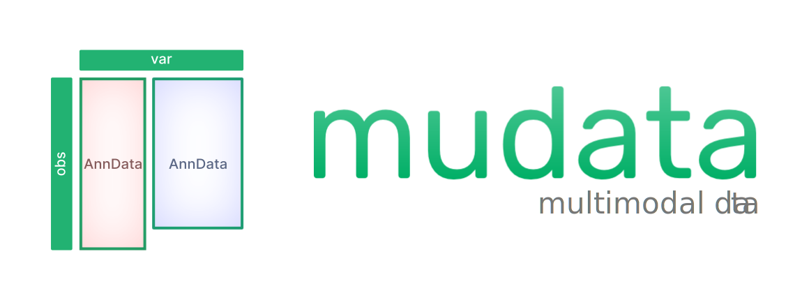

[](http://mudata.readthedocs.io/)
[](https://pypi.org/project/mudata)
[](https://numfocus.org)

# MuData – multimodal data

[Documentation](https://mudata.readthedocs.io/) | [Publication](https://genomebiology.biomedcentral.com/articles/10.1186/s13059-021-02577-8)

For using `MuData` in multimodal omics applications see [`muon`](https://github.com/scverse/muon).

## Data structure

In the same vein as [AnnData](https://github.com/theislab/anndata) is designed to represent unimodal annotated datasets in Python, `MuData` is designed to provide functionality to load, process, and store multimodal omics data.


```
MuData
  .obs     -- annotation of observations (cells, samples)
  .var     -- annotation of features (genes, genomic loci, etc.)
  .obsm    -- multidimensional cell annotation, 
              incl. a boolean for each modality
              that links .obs to the cells of that modality
  .varm    -- multidimensional feature annotation, 
              incl. a boolean vector for each modality
              that links .var to the features of that modality
  .mod
    AnnData
      .X    -- data matrix (cells x features)
      .obs  -- cells metadata (assay-specific)
      .var  -- annotation of features (genes, peaks, genomic sites)
      .obsm
      .varm
      .uns
  .uns
```

## Overview

### Input

`MuData` can be thought of as a multimodal container, in which every modality is an AnnData object:

```py
from mudata import MuData

mdata = MuData({'rna': adata_rna, 'atac': adata_atac})
```

If multimodal data from 10X Genomics is to be read, convenient readers are provided by [`muon`](https://github.com/scverse/muon) that return a `MuData` object with AnnData objects inside, each corresponding to its own modality:

```py
import muon as mu

mu.read_10x_h5("filtered_feature_bc_matrix.h5")
# MuData object with n_obs × n_vars = 10000 × 80000 
# 2 modalities
#   rna:	10000 x 30000
#     var:	'gene_ids', 'feature_types', 'genome', 'interval'
#   atac:	10000 x 50000
#     var:	'gene_ids', 'feature_types', 'genome', 'interval'
#     uns:	'atac', 'files'
```

### I/O with `.h5mu` files

`MuData` objects represent modalities as collections of AnnData objects. These collections can be saved to disk and retrieved using HDF5-based `.h5mu` files, which design is based on `.h5ad` file structure.

```py
import mudata as md

mdata_pbmc.write("pbmc_10k.h5mu")
mdata = md.read("pbmc_10k.h5mu")
```

It allows to effectively use the hierarchical nature of HDF5 files and to read/write AnnData object directly from/to `.h5mu` files:

```py
adata = md.read("pbmc_10k.h5mu/rna")
md.write("pbmc_10k.h5mu/rna", adata)
```

## Citation

If you use `mudata` in your work, please cite the publication as follows:

> **MUON: multimodal omics analysis framework**
> 
> Danila Bredikhin, Ilia Kats, Oliver Stegle
>
> _Genome Biology_ 2022 Feb 01. doi: [10.1186/s13059-021-02577-8](https://doi.org/10.1186/s13059-021-02577-8).

You can cite the scverse publication as follows:

> **The scverse project provides a computational ecosystem for single-cell omics data analysis**
>
> Isaac Virshup, Danila Bredikhin, Lukas Heumos, Giovanni Palla, Gregor Sturm, Adam Gayoso, Ilia Kats, Mikaela Koutrouli, Scverse Community, Bonnie Berger, Dana Pe’er, Aviv Regev, Sarah A. Teichmann, Francesca Finotello, F. Alexander Wolf, Nir Yosef, Oliver Stegle & Fabian J. Theis
>
> _Nat Biotechnol._ 2023 Apr 10. doi: [10.1038/s41587-023-01733-8](https://doi.org/10.1038/s41587-023-01733-8).

[//]: # "numfocus-fiscal-sponsor-attribution"

MuData is part of the scverse project ([website](https://scverse.org), [governance](https://scverse.org/about/roles)) and is fiscally sponsored by [NumFOCUS](https://numfocus.org/).
Please consider making a tax-deductible [donation](https://numfocus.org/donate-to-scverse) to help the project pay for developer time, professional services, travel, workshops, and a variety of other needs.

<a href="https://numfocus.org/project/scverse">
  
</a>

